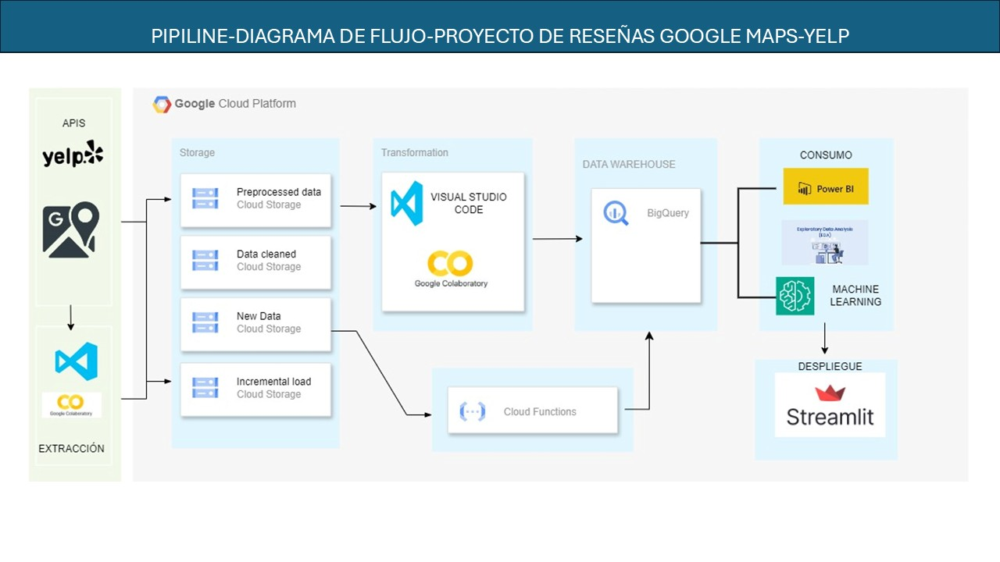

# Análisis de Datos de Google Maps

Este proyecto se centra en el procesamiento y análisis de datos de reseñas de Google Maps. Se han combinado múltiples archivos CSV que contienen información de usuarios, reseñas y calificaciones de diferentes ubicaciones.

## Objetivos del Proyecto
- Unificar y limpiar los datos provenientes de diversas fuentes.
- Identificar valores nulos y decidir la mejor estrategia para manejarlos.
- Analizar la distribución de calificaciones y detectar posibles sesgos.
- Extraer insights a partir de las fechas y tendencias en las reseñas.

## Procesamiento de Datos
- Se han fusionado múltiples archivos CSV en un solo DataFrame.
- Se eliminaron columnas irrelevantes para el análisis, como `resp` y `pics`.
- Se identificaron y trataron valores nulos para mejorar la calidad de los datos.
- Se verificaron y eliminaron registros duplicados según `gmap_id`.

## Exploración de Datos
- Se analizó la distribución de ratings (1 a 5 estrellas).
- Se determinó el rango de fechas de las reseñas.
- Se identificaron patrones en los datos que podrían ser relevantes para estudios posteriores.

## Conclusiones
Este proceso ha permitido estructurar los datos de manera que puedan ser utilizados para futuros análisis y visualizaciones. Se pueden realizar estudios adicionales para detectar tendencias y patrones en las reseñas.


```
📦 yelp-google-reviews
│── 📄 README.md                 # Descripción del proyecto, instrucciones y equipo
│── 📄 requirements.txt          # Librerías necesarias para el proyecto
│
├── 📂 data                      # Datos del proyecto
│   ├── 📂 raw                   # Datos en bruto (sin procesar)
│   ├── 📂 processed             # Datos limpios y transformados
│   ├── 📂 external              # Datos de fuentes externas
│   ├── 📄 data_dictionary.md    # Diccionario de datos y explicaciones
│
├── 📂 notebooks                 # Notebooks Jupyter
│   ├── 📄 01_EDA.ipynb          # Análisis exploratorio de datos
│   ├── 📄 02_Feature_Selection.ipynb  # Selección de características
│   ├── 📄 03_Model_Training.ipynb  # Entrenamiento de modelos
│   ├── 📄 04_Model_Evaluation.ipynb  # Evaluación y métricas de modelos
│
├── 📂 src                       # Código fuente del proyecto
│   ├── 📂 data_preprocessing    # Scripts de limpieza y transformación de datos
│   ├── 📂 models                # Scripts de entrenamiento y evaluación de modelos
│   ├── 📂 visualization         # Scripts para generar gráficos y visualizaciones
│   ├── 📂 api                   # Código de la API (FastAPI o Flask)
│
├── 📂 app                       # Aplicación final o dashboard
│   ├── 📄 app.py                # Código principal de la aplicación
│   ├── 📂 static                # Archivos estáticos (CSS, imágenes, etc.)
│   ├── 📂 templates             # Plantillas HTML (si es necesario)
│
├── 📂 reports                   # Documentación y reportes
│   ├── 📄 final_report.pdf      # Informe final del proyecto
│   ├── 📄 presentation.pptx     # Presentación del proyecto
│   ├── 📄 results.md            # Resumen de los resultados obtenidos
│
├── 📂 tests                     # Pruebas y validaciones
│   ├── 📄 test_data_processing.py  # Pruebas de limpieza de datos
│   ├── 📄 test_model.py         # Pruebas de modelos de ML
│   ├── 📄 test_api.py           # Pruebas de la API
│
└── 📂 docs                      # Documentación técnica
    ├── 📄 project_overview.md   # Descripción técnica del proyecto
    ├── 📄 methodology.md        # Explicación de la metodología utilizada
    ├── 📄 team.md               # Información sobre los miembros del equipo

```
# <h1 align="center">**`Insight Labs`**</h1>


## YELP & GOOGLE MAPS - REVIEWS AND RECOMMENDATIONS


## Índice

<details>
  <summary>Tabla de contenido</summary>

  1. [Índice](#índice)
  2. [Sobre el proyecto](#sobre-el-proyecto)
  3. [​Cliente](#​cliente: invertur global s.a.c)
  4. [Indicadores Claves de Rendimiento (KPIs)](#Indicadores Claves de Rendimiento (KPIs))
  5. [​Stack Tecnológico y Pipeline](#​Stack Tecnológico y Pipeline)
  6. [Machine Learning](#Machine Learning)
  7. [Dashboard](#dashboard)
  8. [Resultados y Conclusiones](#Resultados y Conclusiones)
  9. [Miembros del Equipo](#miembros-del-equipo)

</details>

## Sobre el proyecto
En el competitivo mercado turístico y gastronómico de los Estados Unidos, la opinión de los usuarios es una fuente clave de información para la toma de decisiones estratégicas. Muchos inversionistas enfrentan desafíos al evaluar oportunidades sin contar con un análisis de datos sólido, lo que puede llevarlos a realizar inversiones poco rentables.

Aquí es donde entra Insights Labs. Somos un equipo apasionado por los datos, comprometido con la excelencia y la innovación. Nos enfrentamos al desafío de analizar grandes volúmenes de información proporcionada por el cliente con el fin de desarrollar un modelo de recomendación estratégico que permita identificar oportunidades clave dentro del mercado turístico y gastronómico.

Utilizamos los datasets nativos de YELP, que contienen reseñas y calificaciones de usuarios sobre una amplia variedad de establecimientos, desde restaurantes hasta hoteles. Adicionalmente, enriquecemos nuestro análisis con datos extraídos de Google Maps, incorporando información geoespacial, calificaciones adicionales, sitios web y otros factores relevantes.


## ​Cliente: InverTur Global S.A.C


Nuestro cliente, InverTur Global S.A.C., es un grupo empresarial con una presencia sólida tanto en el mercado estadounidense como en el internacional. Con un enfoque en la expansión y diversificación de inversiones en el sector turístico y gastronómico, buscan optimizar sus estrategias de inversión basándose en datos precisos y modelos predictivos avanzados.

## :white_check_mark: ```Objetivo General del Proyecto ```
Nuestro objetivo es proporcionar insights valiosos mediante el cruce de reseñas de usuarios en plataformas como Yelp y Google Maps, con el fin de optimizar las inversiones de nuestro cliente y facilitar la toma de decisiones estratégicas en el mercado turístico y gastronómico.


## :white_check_mark: ```Objetivos Específicos ```

:green_circle: Análisis de Opiniones y Sentimientos: Aplicar técnicas de procesamiento de lenguaje natural (NLP) a las reseñas de Yelp y Google Maps para evaluar la percepción de los clientes sobre los negocios en el sector turístico y gastronómico en Estados Unidos.

:green_circle: Identificación de Oportunidades de Inversión: Implementar un modelo de machine learning para determinar las ubicaciones geográficas óptimas para abrir nuevos negocios, tomando en cuenta factores como la cantidad de reseñas positivas, tendencias de consumo y datos demográficos.

:green_circle: Predicción de Tendencias en Negocios: Emplear algoritmos de machine learning para anticipar qué categorías dentro del sector experimentarán crecimiento o declive, utilizando datos históricos de reseñas y calificaciones.

:green_circle: Desarrollo de un Sistema de Recomendación: Crear un sistema de recomendación para inversionistas, basado en datos, que sugiera oportunidades de negocio en el mercado turístico y gastronómico.

## :white_check_mark: ​Alcances del Proyecto
* El análisis se enfocará en identificar negocios del sector turístico y gastronómico con alto potencial de inversión.
* Se priorizarán las regiones con mayor flujo de turistas y crecimiento en la demanda de servicios gastronómicos y de alojamiento.
* Se desarrollará un dashboard interactivo para visualizar las recomendaciones y análisis generados por el sistema.
* Nos centramos en California-Estados Unidos, (sin importar el tipo) y valor de PBI per cápita
<p align="center">
  
</p>

## :white_check_mark: ```Desarrollo del Proyecto```


- Sprint Nro 1: Durante este sprint se realizó un análisis prelimiar del comportamiento de los datos provenientes de Yelp y Google Maps. Este análisis se centró especialmente en el las reseñas y ubicaciones de negocios. Se utilizaron diversas técnicas de Análisis Exploratorio de Datos (EDA) para identificar valores faltantes, detectar valores atípicos y registros duplicados, y generar visualizaciones coherentes que faciliten la interpretación de la información. También se estableció el stack tecnológico y se definieron los KPIs.

- Sprint Nro 2: En esta etapa de Data Engineering se trabajó en forma exhaustiva en la plataforma de Google Cloud, se generaron los buckes necesarios para el almacenamiento de los datos así como la función para las transformaciones correspondientes.

- Sprint Nro 3: Se crearan modelos de Machine Learning, el despliegue del Sistema de Recomendación de Negocios a través de Streamlit y la implementación del Dashboard Interactivo.


## 🏆 Indicadores Claves de Rendimiento (KPIs)


KPI :one: : **Aumento del 10% en la Cantidad de Clientes**
Definición: Este KPI mide el crecimiento anual en la cantidad de clientes, lo cual refleja la efectividad de las estrategias de marketing y la capacidad del negocio para atraer y retener nuevos clientes. Un aumento del 10% en la cantidad de clientes indica un crecimiento significativo en la base de clientes y mayores oportunidades de ingresos.
Objetivo: +10%


KPI :two: : **Tasa de Crecimiento de Nuevas Reseñas (TCNR)**
Calcula la tasa de aumento en la cantidad de reseñas (de cualquier tipo) en un periodo de tiempo.
TCNR = (Cantidad de reseñas periodo actual-Cantidad de reseñas periodo anterior*100)/Cantidad de reseñas periodo actual


KPI :three: : **Tasa  Crecimiento del 10% en la cantidad de locales**
Definición: Crecimiento anual de la cantidad de sucursales. Esto proporciona una métrica clara y cuantificable que refleja la expansión y vitalidad del negocio.
Objetivo: +10%


## ​Stack Tecnológico y Pipeline



## :white_check_mark: ```Machine Learning ```
El sistema de recomendación junto al dashboard se han implementado en **Streamlit** PROXIMAMENTE


## :white_check_mark: ```Dashboard ```
El Dashboard completo en formato pdf se encuentra en la carpeta 
PROXIMAMENTE


## :white_check_mark: ```Resultados y Conclusiones```

Insights Labs está transformando el análisis de datos en estrategias ganadoras. Nuestro sistema de recomendación será la herramienta clave para inversionistas que buscan maximizar sus oportunidades en el mercado turístico y gastronómico. Con datos precisos y análisis avanzado, estamos redefiniendo la forma en que las empresas toman decisiones inteligentes.

Porque en el mundo de las inversiones, el conocimiento es la clave del éxito.

## Miembros del Equipo

<table align="center">
  <tr>
    <td align="center"><b>Caldera Emiliano Exequiel</b></td>
    <td align="center"><b>Sergio Piratoba</b></td>
    <td align="center"><b>Juan Diego</b></td>
    <td align="center"><b>Ruth Castañeda</b></td>
    <td align="center"><b>Efrain Linares</b></td>
  </tr>
  <tr>
    <td align="center"></td>
    <td align="center"></td>
    <td align="center"></td>
    <td align="center"></td>
    <td align="center"></td>
  </tr>
  <tr>
    <td align="center">Data Engineer ML ops</td>
    <td align="center">Project Leader
    Data science</td>
    <td align="center">Task  Manager Data engineer</td>
    <td align="center">Data Analyst</td>
    <td align="center">Data analyst</td>
  </tr>

  <tr>
    <td align="center"><a href="www.linkedin.com/in/emiliano-caldera"></a></td>
    <td align="center"><a href="https://www.linkedin.com"></a></td>
    <td align="center"><a href="https://www.linkedin.com"></a></td>
    <td align="center"><a href="https://www.linkedin.com/"></a></td>
    <td align="center"><a href="https://www.linkedin.com/"></a></td>
  </tr>

